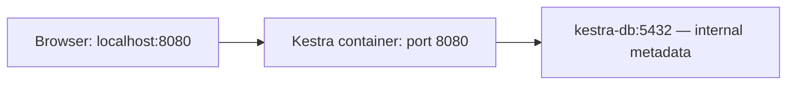

# Week 5 — Workflow orchestration with Kestra

[Module homepage](../../README.md) · [Downloads before class](../../preparation/week-05.md)

We will use Kestra to coordinate pipeline tasks and inspect their execution. Start by opening its web interface. The commands below create a separate Week 5 environment; they do not replace the taxi database from Weeks 2 and 4.

## 1. Understand the two services

| Service | Purpose |
|---|---|
| `kestra` | Runs the workflow application and serves its browser interface. |
| `kestra-db` | Stores Kestra's internal workflow definitions and execution state in PostgreSQL. It does not store our taxi trips. |



The existing taxi PostgreSQL and pgAdmin services remain in `examples/nyc-taxi`. This first step only starts Kestra; connecting it to the taxi pipeline comes later.

## 2. Create your local settings

Start Docker. From the repository root:

```sh
cd weeks/05-workflow-orchestration
```

Copy `.env` to `.env` in this folder. On macOS/Linux:

```sh
cp .env .env
```

On Windows PowerShell:

```powershell
Copy-Item .env.example .env
```

If `.env` already exists here, keep it. Open it in your editor and replace both example passwords. The Kestra login password must contain at least eight characters, including an uppercase letter, a lowercase letter, and a number. `KESTRA_USER` must be an email address; it is a local login name, not a cloud account. Use `KESTRA_USER` and `KESTRA_PASSWORD` to log into Kestra. `KESTRA_DB_PASSWORD` is used internally by Kestra to connect to its database.

`compose.yaml` defines the containers; `application.yaml` configures Kestra and reads its login settings from environment variables.

This is a separate `.env` from the Week 2 example. Git ignores it. All remaining terminal commands run from `weeks/05-workflow-orchestration`.

## 3. Start Kestra

Check that Compose can read your settings:

```sh
docker compose config --quiet
```

No output means the configuration is valid; this does not test a running application.

Start the services:

```sh
docker compose up -d
```

Compose starts the metadata database, waits for its health check, and then starts Kestra. `-d` leaves the services running in the background. Kestra may still need time to finish starting after this command returns.

Check the containers and follow startup messages:

```sh
docker compose ps
docker compose logs -f kestra
```

Press **Ctrl+C** to stop following logs; the services remain running.

## 4. Open the web interface

Open **[http://localhost:8080](http://localhost:8080)** in your browser. Log in with the `KESTRA_USER` and `KESTRA_PASSWORD` values from this folder's `.env`.

`localhost` means your own laptop. The Compose port mapping forwards your browser's connection to the Kestra container. If the page is not ready, wait a little and check the logs again.

**Checkpoint:** you can log in and see Kestra's interface. An empty flow list is expected before you create your first workflow. Closing the browser does not stop Kestra.

Your existing pgAdmin interface, if running, is still at **http://localhost:8085**.

## 5. Stop and return later

To stop the Week 5 services without removing their containers:

```sh
docker compose stop
```

To start them again:

```sh
docker compose up -d
```

The named volumes `kestra_db` and `kestra_files` preserve the metadata and files. `docker compose down` removes containers but retains these volumes. **Do not add `-v` unless you intend to erase this Kestra environment's saved data.** These volumes are separate from the taxi database's volumes.

## If something fails

| Problem | What to check |
|---|---|
| Docker connection error | Start Docker Desktop/the Docker engine. |
| A required setting is missing | Confirm `.env` exists in this folder and contains the four settings from `.env`. |
| Port 8080 is already in use | Set `KESTRA_PORT=18080` in `.env`, run `docker compose up -d` again, and open `http://localhost:18080`. |
| Login fails | Use the Kestra login from this folder's `.env`, not the pgAdmin login. After changing settings, rerun `docker compose up -d`. |
| Browser cannot connect | Inspect `docker compose ps` and `docker compose logs --tail 100 kestra`. |
| Metadata database fails after changing its password | PostgreSQL initializes its password only when its data volume is first created. Changing `.env` alone does not update an existing database password; restore the original setting or ask the instructor for help. |

**Finish with:** a working Kestra login and an explanation of why its internal database is separate from the taxi database.

## Next — Create your first flow

Once you can log in, follow [Your first Kestra flow](part-1-first-flow.md). You will supply a year and month, run one logging task, and compare two executions.
